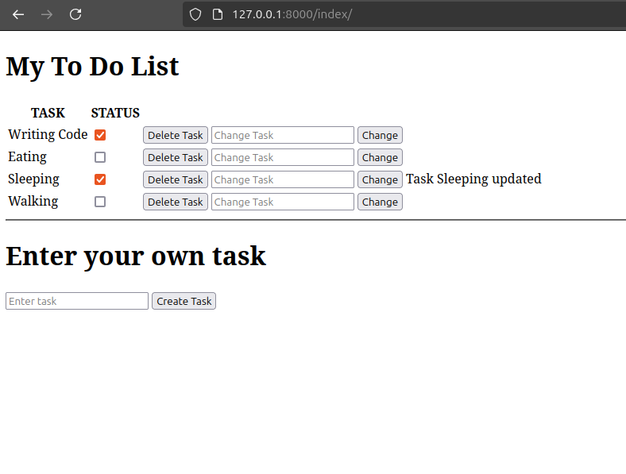

# To Do Page using Django 

Implementing a basic To Do website

## Features

- User can add and delete tasks
- User can update task as complete and pending (shown through checkbox) and can also change task name

## Screenshot

